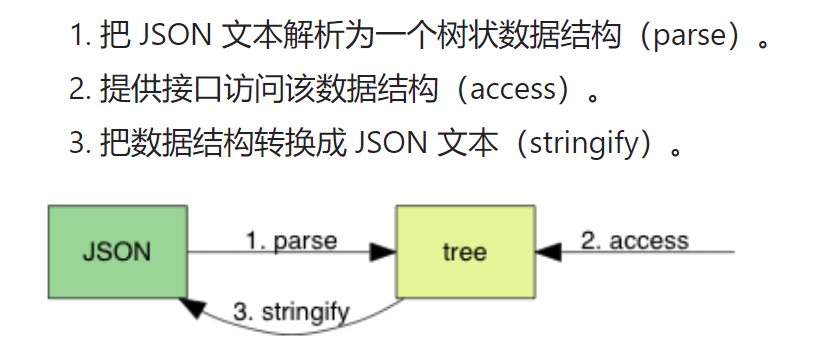

实现Json库，要做3件事：
- parse: 把普通数据转换为 Json对象的数据结构
- access: 访问Json对象，因为你可能要修改该Json对象，添加元素等，所以要有访问接口
- stringfy：把Json对象序列化为一个传统的`Json字符串

## 对于string类型的Json数据的解析

解析字符串类型数据，基本上就是直接把字符串拿过来，直接存储在结果中即可。
字符串的解析不需要像 true，false那样，逐个判断字符是否合法。

<b>但是，字符串解析，主要问题在于（需要解析，解析的目的，解析的任务）：
    需要处理转义字符、Unicode编码、等问题</b>

- 为什么需要 `malloc`？
    - 本质是因为string类型数据，它的长度是未知的（准确来说，应该是不同的string，长度可能不一样）那么你存储string结果的 lept_context中应该如何区设计一个结构来存储string解析结果呢？
     显然，你只能 不断malloc，对于每解析一个字符，都malloc一次，这样string所有字符解析完毕后，malloc都执行了应有的次数。显然，这样效率很低。 

    - 很容易想到，优化不断malloc的问题，有以下几个方法： 
    1、用一个类似==C++ std::vector==的容器来存储解析结果即可 
    因为std::vector是一个可动态变长的数组（本质就是自动malloc申请内存而已，当然可以预设更长的长度）这样在解析string的时候，直接push_back()即可 
    2、总之，就是要避免不断malloc，所以在C语言（当然项目场景）下，可以预设一个==很长的字符数组== char arr[256];即可
    但这样缺点在于，可能浪费内存，大部分用不上，也可能对于某些很长的Json字符串数据，arr[256]仍然不够
 
- 为什么要用`缓冲区`？
    - 原因就是上述。为了解决`不断malloc`的问题，要用一个 提前预设宽度（预处理malloc）的容器来处理
 
- 为什么用`栈结构`的缓冲区？
    - 我觉得，什么结构都可，主要作用是 缓冲、存储，并不是需要栈的先进后出机制，队列也可
 
- 字符串双引号问题？
    - 根据 JSON 标准，字符串必须用`双引号`包裹
    - 例如，"Hello" 在 C 语言中只是一个普通的字符串常量，但它缺少了 JSON 中规定的双引号。
    - `""Hello""` 才是一个合法的 Json字符串数据，实际程序处理，需要转义，所以 `"\"Hello\""`

## 比较 难+有意义 的地方

- `string`类型数据的解析，涉及到 `针对malloc的缓冲优化方案设计、栈设计、指针偏移`
- `string`类型数据的解析，`转义字符`的解析流程
- `Valgrind`内存泄漏检测工具
- `string，array`的解析，都比较复杂————可以熟悉C语言栈缓冲区处理频繁malloc的设计理念
- `object`类型数据的解析，和数组解析类似，解析过程的while循环的 流程化编程 方法 可学习